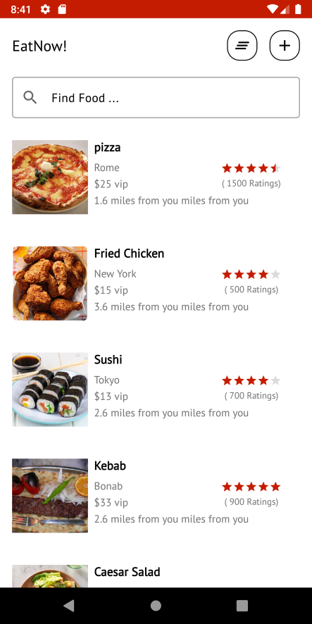
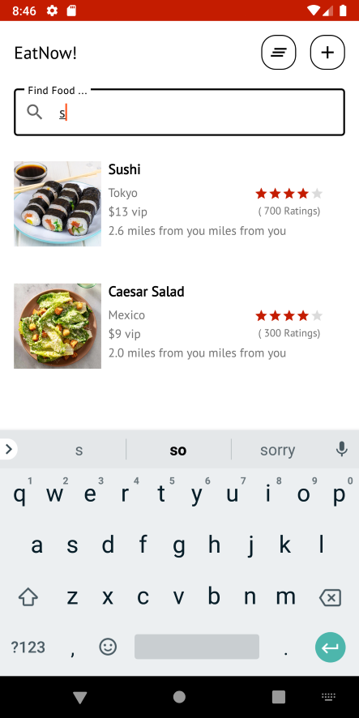
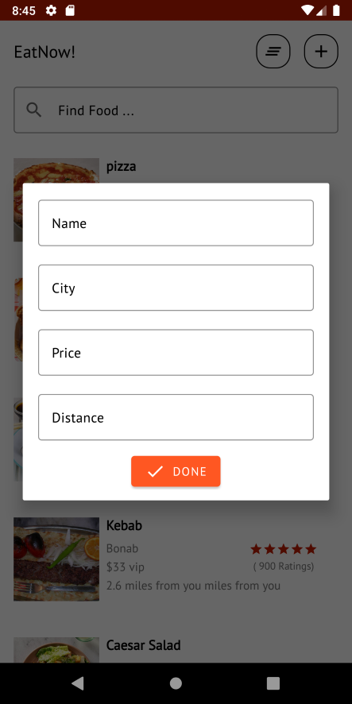

# EatNow!

**EatNow!** demonstrates MVP Architecture on Android with Room.

The purpose of this repository is to demonstrate below:

- How to use MVP to structure your app code.
- Implementing repository pattern with MVP.
- Using Coroutines With Room
- How to support both night,light themes on Android.

## 📷 Previews

 
 

## 💻 Concepts used in the project
MVP Architedture, Room ORM, Kotlin Coroutines, Glide, ...

